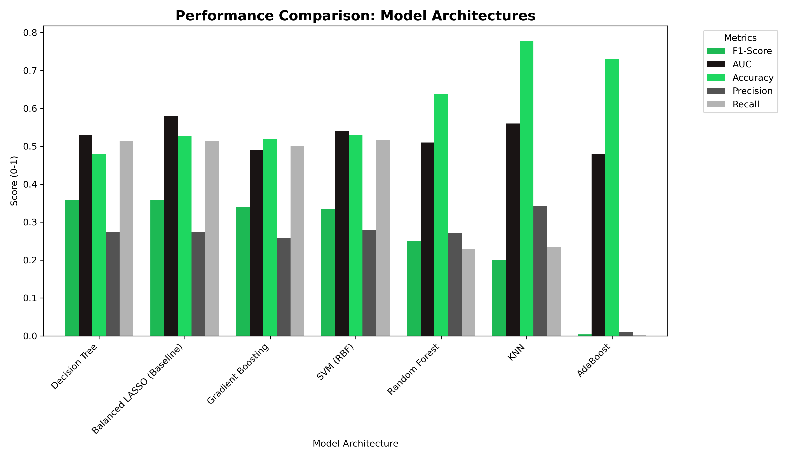

## README: Spotify User Churn Prediction

### 1. Business Problem

#### The Business Context
In a competitive streaming landscape, acquiring a new customer is significantly more expensive than retaining an existing one. For a subscription-based service like Spotify, churn—the rate at which subscribers cancel their premium status—directly impacts long-term valuation and Monthly Recurring Revenue (MRR).

#### Post-Identification Strategy
Identifying "High-Risk" customers is only the first step. Once the model flags a user as likely to churn, the business intends to deploy targeted Retention Workflows, including:

**Targeted Incentives:** Offering limited-time discounts or "3 months for the price of 1" deals to price-sensitive users.

**Feature Education:** Sending automated push notifications highlighting premium features the user hasn't utilized (e.g., offline downloads or high-fidelity audio).

**Product Feedback Loops:** Triggering micro-surveys to understand dissatisfaction before the user reaches the "cancel" button.

**Personalized Content:** Using algorithmic "We Miss You" playlists to re-establish the habit of daily listening.

#### Project Objective
The objective of this project is to develop a predictive classifier that identifies potential churners with high reliability.

**What we are optimizing for:**

While Accuracy is a standard metric, it is misleading in an imbalanced subscription environment (74% active / 26% churned). Therefore, this project optimizes for:

F1-Score: To ensure the model remains "useful," we use the F1-Score to maintain a functional balance between catching churners (Recall) and ensuring our marketing spend isn't wasted on a massive population of stable users (Precision).

### 2. Data Cleaning & Preprocessing

**Data Integrity:** The dataset was found to be highly robust upon initial inspection. There were no missing, null, or "unknown" values across the behavioral or demographic features. Consequently, no imputation or data cleaning was required, allowing the project to proceed directly to statistical validation.

**Outlier Analysis:**
1. We conducted a deep dive into the distribution of user activity, specifically focusing on ads_listened_per_week. Two distinct methods were used to identify anomalies:
2. Z-Score Analysis: Using a z_score_outlier_analysis function, we found that 0.92% of the data points qualified as statistical outliers (Z-score > 3). This identifies a small group of users experiencing an extreme volume of ad exposure compared to the average listener.
3. Interquartile Range (IQR) Check: The IQR method identified 1,683 outliers in the same category. This count is significantly higher than the Z-score results because the IQR is more sensitive to "skewed" data. It captures values that are "unusual" within the context of the distribution, even if they don't reach the "extreme" threshold of a Z-score.
4. The discrepancy between the two methods and the high volume of outliers in ad exposure is likely not a data error, but a reflection of the product's structure. Since Premium users do not see ads, their data points for ads_listened_per_week are consistently zero. This creates a heavily skewed distribution where any active "Free" user appears as a statistical outlier relative to the "Premium" population.
5. This insight was critical for the modeling phase, as it confirmed that ad-related features would serve as a primary differentiator between the two user classes.

### 3. Feature Engineering Strategies

To find the optimal signal for churn, two competing strategies were developed. Both began with a shared foundation of data hygiene and encoding but diverged in how they handled feature complexity.

#### **The Baseline Foundation**
Regardless of the strategy, the following transformations were applied to the raw data:
* **Dimensionality Cleaning:** The `user_id` was dropped, as it served only as a unique identifier and lacked predictive power.
* **Behavioral Feature Creation:** Two new domain-specific features were engineered to capture user engagement:
    * **`ad_music_ratio`**: Calculated to measure the "interruptive" nature of the experience (Ads Listened / Songs Listened).
    * **`avg_song_length`**: Created to determine if listening endurance or session depth correlates with retention.
* **Categorical Encoding:** One-Hot Encoding was applied to non-numeric variables (such as `gender` and `region`) to translate them into a machine-readable format.
* **Standardization:** All features were processed using `StandardScaler` to ensure that features with larger ranges (like `total_listening_time`) did not overshadow binary or smaller-scale features during model training.

#### **Strategy A: Polynomial Features (The "Squared" Approach)**
This strategy was built on the hypothesis that churn behavior isn't always linear. For example, a slight increase in ad exposure might not matter, but a "squared" increase might lead to an exponential rise in churn probability.
* **Technique:** Generated **Polynomial Features of Degree 2**.
* **Focus:** Specifically targeted **Squared Terms** ($x^2$) rather than just interaction terms ($x \times y$). 
* **Goal:** To capture "accelerated" behavioral trends, allowing the model to see if extreme levels of specific activities (like skipping) act as a much stronger churn trigger than moderate levels.

#### **Strategy B: Lean Feature Set (Efficiency)**
After observing the high dimensionality of the Polynomial approach, a second strategy was tested to see if "less is more."
* **Technique:** Pruned the feature set down to the **22 most impactful features** identified during initial exploration.
* **Goal:** To reduce noise, prevent potential overfitting from the polynomial expansion, and create a more computationally efficient model for real-time deployment.

### 4. Modeling Procedure

The modeling phase was executed in two parallel tracks for both the **Polynomial** and **Lean** feature strategies. By maintaining a consistent evaluation pipeline, we were able to isolate the impact of feature engineering on model performance.

#### **Phase I: Baseline Modeling**
Before testing complex architectures, we established a "performance floor" using Logistic Regression.

* **Logistic Regression with LASSO (L1 Regularization):** We utilized LASSO to perform automated feature selection. By penalizing less impactful coefficients, the model effectively "zeroed out" noise, which was particularly useful for the high-dimensional Polynomial dataset.

* **Hyperparameter Tuning:** We utilized `GridSearchCV` to optimize the regularization strength (`C`). This ensured that our baseline was not just a "default" model, but the strongest possible linear representation of the data.

#### **Phase II: Advanced Modeling**
To capture non-linear patterns that a linear regression might miss, we deployed six advanced machine learning architectures SVM, Gradient Boosting, Ada Boosting, Decision Tree, KNN, and Random Forest.

#### **Optimization & Evaluation Strategy**

For every model in the advanced suite, we followed a standardized protocol:

* **GridSearchCV Implementation:** We performed an exhaustive search over hyperparameters (such as `max_depth`, `n_estimators`, and `kernel` types) to find the "Best Estimator" for each architecture.

* **Primary Metric (F1-Score):** Because our dataset is imbalanced (74/26), we directed `GridSearchCV` to optimize for the **F1-Score**. This prevented the models from simply guessing the majority class to achieve high accuracy.

* **Model Comparison:** After tuning, we extracted the performance metrics of every "Best Estimator" and compiled them into a master comparison table to select the final deployment candidate.

### 5. Summary of Results & Comparison

This project evaluated two distinct data strategies. Below is the performance breakdown of our first iteration, which utilized **Polynomial Features (Degree 2)** to capture complex, non-linear interactions.

#### Strategy A: Polynomial Features Results

In this iteration, we expanded the dataset significantly. While we expected the increased dimensionality to provide more "signal," the results showed a plateau in predictive power.

| Model | F1-Score | AUC | Accuracy | Precision | Recall |
| :--- | :--- | :--- | :--- | :--- | :--- |
| **Decision Tree** | **0.3585** | 0.5300 | 0.4800 | 0.2750 | 0.5140 |
| **Balanced LASSO (Baseline)** | 0.3580 | **0.5800** | 0.5260 | 0.2740 | 0.5140 |
| **Gradient Boosting** | 0.3404 | 0.4900 | 0.5200 | 0.2580 | 0.5000 |
| **SVM (RBF)** | 0.3345 | 0.5400 | 0.5300 | 0.2790 | **0.5170** |
| **Random Forest** | 0.2496 | 0.5100 | 0.6380 | 0.2720 | 0.2300 |
| **KNN** | 0.2011 | 0.5600 | **0.7790** | **0.3430** | 0.2340 |
| **AdaBoost** | 0.0036 | 0.4800 | 0.7300 | 0.0100 | 0.0020 |

#### Technical Analysis of Strategy A

  * **F1-Score Stability:** The highest F1-score achieved was **0.3585** (Decision Tree). Surprisingly, this is nearly identical to our baseline LASSO model ($0.3580$), suggesting that the extra polynomial terms added more "noise" than "value."
  * **ROC/AUC Insights:** The AUC values hovered between **0.48 and 0.58**. This indicates that the models are only slightly better than a random guess at distinguishing between the two classes, even with complex interaction terms.
  * **The Complexity Penalty:** Models like **KNN** and **AdaBoost** showed high Accuracy but failed significantly on F1 and Recall. This confirms that adding more features actually made it harder for these algorithms to find a clean separation between churners and active users.

#### Key Takeaway: More Features \!= Better Results

Using a Polynomial set (200+ terms) of features did not yield very good results on the modeling front, so we switched to not using polynomial features. This resulted in a feature set of 22 features.

