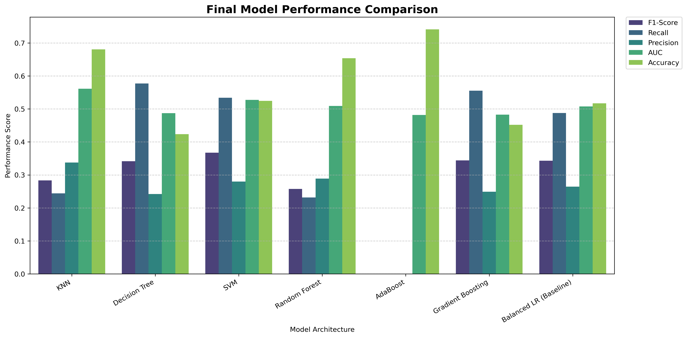
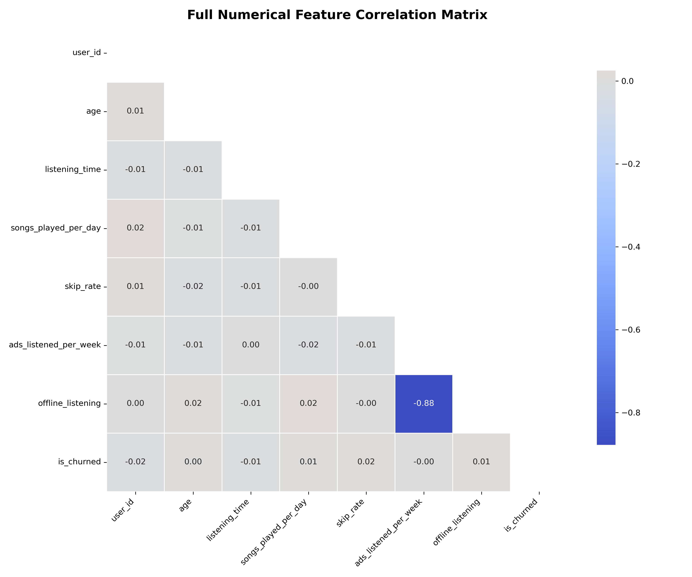
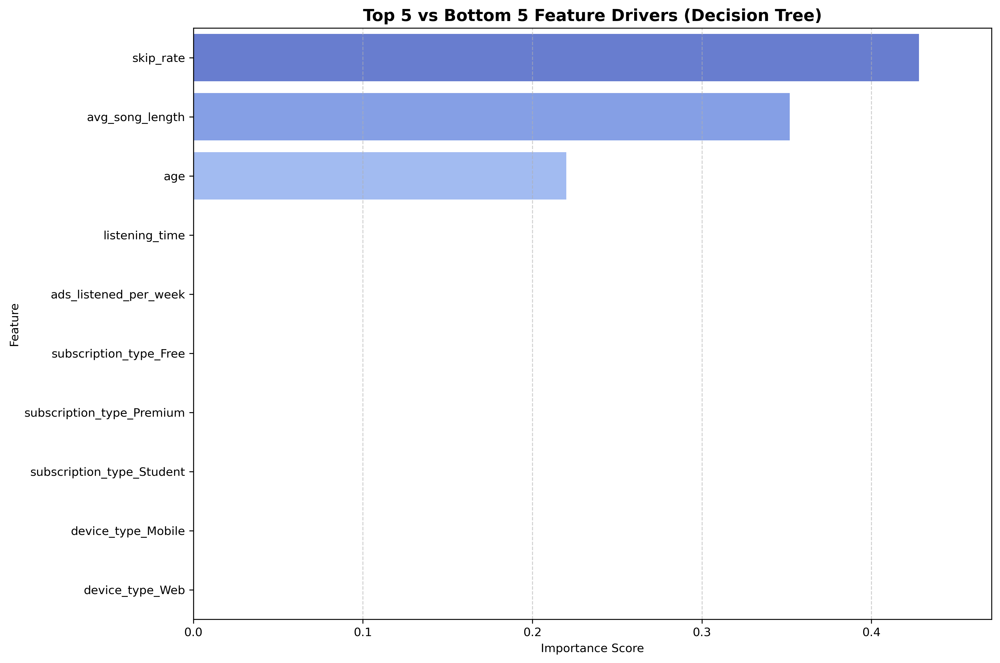

## README: Spotify User Churn Prediction

### 1. Business Problem

#### The Business Context
In a competitive streaming landscape, acquiring a new customer is significantly more expensive than retaining an existing one. For a subscription-based service like Spotify, churn—the rate at which subscribers cancel their premium status—directly impacts long-term valuation and Monthly Recurring Revenue (MRR).

#### Post-Identification Strategy
Identifying "High-Risk" customers is only the first step. Once the model flags a user as likely to churn, the business intends to deploy targeted Retention Workflows. 

#### Project Objective
The objective of this project is to develop a predictive classifier that identifies potential churners with high reliability.

**What we are optimizing for:**

While Accuracy is a standard metric, it is misleading in an imbalanced subscription environment (74% active / 26% churned). Therefore, this project optimizes for:

F1-Score: To ensure the model remains "useful," we use the F1-Score to maintain a functional balance between catching churners (Recall) and ensuring our marketing spend isn't wasted on a massive population of stable users (Precision).

### 2. Data Cleaning & Preprocessing

**Data Integrity:** The dataset was found to be highly robust upon initial inspection. There were no missing, null, or "unknown" values across the behavioral or demographic features. Consequently, no imputation or data cleaning was required, allowing the project to proceed directly to statistical validation.

**Outlier Analysis:**
1. We conducted a deep dive into the distribution of user activity, specifically focusing on ads_listened_per_week. Two distinct methods were used to identify anomalies:
2. Z-Score Analysis: Using a z_score_outlier_analysis function, we found that 0.92% of the data points qualified as statistical outliers (Z-score > 3). This identifies a small group of users experiencing an extreme volume of ad exposure compared to the average listener.
3. Interquartile Range (IQR) Check: The IQR method identified 1,683 outliers in the same category. This count is significantly higher than the Z-score results because the IQR is more sensitive to "skewed" data. It captures values that are "unusual" within the context of the distribution, even if they don't reach the "extreme" threshold of a Z-score.
4. The discrepancy between the two methods and the high volume of outliers in ad exposure is likely not a data error, but a reflection of the product's structure. Since Premium users do not see ads, their data points for ads_listened_per_week are consistently zero. This creates a heavily skewed distribution where any active "Free" user appears as a statistical outlier relative to the "Premium" population.
5. This insight was critical for the modeling phase, as it confirmed that ad-related features would serve as a primary differentiator between the two user classes.

### 3. Feature Engineering Strategies

To find the optimal signal for churn, two competing strategies were developed. Both began with a shared foundation of data hygiene and encoding but diverged in how they handled feature complexity.

#### **The Baseline Foundation**
Regardless of the strategy, the following transformations were applied to the raw data:
* **Dimensionality Cleaning:** The `user_id` was dropped, as it served only as a unique identifier and lacked predictive power.
* **Behavioral Feature Creation:** Two new domain-specific features were engineered to capture user engagement:
    * **`ad_music_ratio`**: Calculated to measure the "interruptive" nature of the experience (Ads Listened / Songs Listened).
    * **`avg_song_length`**: Created to determine if listening endurance or session depth correlates with retention.
* **Categorical Encoding:** One-Hot Encoding was applied to non-numeric variables (such as `gender` and `region`) to translate them into a machine-readable format.
* **Standardization:** All features were processed using `StandardScaler` to ensure that features with larger ranges (like `total_listening_time`) did not overshadow binary or smaller-scale features during model training.

#### **Strategy A: Polynomial Features (The "Squared" Approach)**
This strategy was built on the hypothesis that churn behavior isn't always linear. For example, a slight increase in ad exposure might not matter, but a "squared" increase might lead to an exponential rise in churn probability.
* **Technique:** Generated **Polynomial Features of Degree 2**.
* **Focus:** Specifically targeted interaction terms ($x \times y$) rather than just **Squared Terms** ($x^2$). 
* **Goal:** To capture "accelerated" behavioral trends, allowing the model to see if extreme levels of specific activities (like skipping) act as a much stronger churn trigger than moderate levels.

#### **Strategy B: Lean Feature Set (Efficiency)**
After observing the high dimensionality of the Polynomial approach, a second strategy was tested to see if "less is more."
* **Technique:** Pruned the feature set down to the **22 most impactful features** identified during initial exploration.
* **Goal:** To reduce noise, prevent potential overfitting from the polynomial expansion, and create a more computationally efficient model for real-time deployment.

### 4. Modeling Procedure

The modeling phase was executed in two parallel tracks for both the **Polynomial** and **Lean** feature strategies. By maintaining a consistent evaluation pipeline, we were able to isolate the impact of feature engineering on model performance.

#### **Phase I: Baseline Modeling**
Before testing complex architectures, we established a "performance floor" using Logistic Regression.

* **Logistic Regression with LASSO (L1 Regularization):** We utilized LASSO to perform automated feature selection. By penalizing less impactful coefficients, the model effectively "zeroed out" noise, which was particularly useful for the high-dimensional Polynomial dataset.

* **Hyperparameter Tuning:** We utilized `GridSearchCV` to optimize the regularization strength (`C`). This ensured that our baseline was not just a "default" model, but the strongest possible linear representation of the data.

#### **Phase II: Advanced Modeling**
To capture non-linear patterns that a linear regression might miss, we deployed six advanced machine learning architectures SVM, Gradient Boosting, Ada Boosting, Decision Tree, KNN, and Random Forest.

#### **Optimization & Evaluation Strategy**

For every model in the advanced suite, we followed a standardized protocol:

* **GridSearchCV Implementation:** We performed an exhaustive search over hyperparameters (such as `max_depth`, `n_estimators`, and `kernel` types) to find the "Best Estimator" for each architecture.

* **Primary Metric (F1-Score):** Because our dataset is imbalanced (74/26), we directed `GridSearchCV` to optimize for the **F1-Score**. This prevented the models from simply guessing the majority class to achieve high accuracy.

* **Model Comparison:** After tuning, we extracted the performance metrics of every "Best Estimator" and compiled them into a master comparison table to select the final deployment candidate.

### 5. Summary of Results & Comparison

This project evaluated two distinct data strategies. Below is the performance breakdown of our first iteration, which utilized **Polynomial Features (Degree 2)** to capture complex, non-linear interactions.

#### Strategy A: Polynomial Features Results

In this iteration, we expanded the dataset significantly. While we expected the increased dimensionality to provide more "signal," the results showed a plateau in predictive power.

| Model | F1-Score | AUC | Accuracy | Precision | Recall |
| :--- | :--- | :--- | :--- | :--- | :--- |
| **Decision Tree** | **0.3585** | 0.5300 | 0.4800 | 0.2750 | 0.5140 |
| **Balanced LASSO (Baseline)** | 0.3580 | **0.5800** | 0.5260 | 0.2740 | 0.5140 |
| **Gradient Boosting** | 0.3404 | 0.4900 | 0.5200 | 0.2580 | 0.5000 |
| **SVM (RBF)** | 0.3345 | 0.5400 | 0.5300 | 0.2790 | **0.5170** |
| **Random Forest** | 0.2496 | 0.5100 | 0.6380 | 0.2720 | 0.2300 |
| **KNN** | 0.2011 | 0.5600 | **0.7790** | **0.3430** | 0.2340 |
| **AdaBoost** | 0.0036 | 0.4800 | 0.7300 | 0.0100 | 0.0020 |

#### Technical Analysis of Strategy A

  * **F1-Score Stability:** The highest F1-score achieved was **0.3585** (Decision Tree). Surprisingly, this is nearly identical to our baseline LASSO model ($0.3580$), suggesting that the extra polynomial terms added more "noise" than "value."
  * **ROC/AUC Insights:** The AUC values hovered between **0.48 and 0.58**. This indicates that the models are only slightly better than a random guess at distinguishing between the two classes, even with complex interaction terms.
  * **The Complexity Penalty:** Models like **KNN** and **AdaBoost** showed high Accuracy but failed significantly on F1 and Recall. This confirms that adding more features actually made it harder for these algorithms to find a clean separation between churners and active users.

#### Key Takeaway: More Features \!= Better Results

In this second iteration, we hypothesized that the noise from 200+ polynomial terms was hindering the models. We streamlined the dataset to **22 core features** and introduced two hand-crafted behavioral metrics: **`ad_music_ratio`** and **`avg_song_length`**.

#### Strategy B: Lean Feature Set Results

Despite the cleaner data and specialized features, the performance remained largely unchanged from our initial baseline, as shown below:

| Model | F1-Score | Recall | Precision | AUC | Accuracy |
| :--- | :--- | :--- | :--- | :--- | :--- |
| **SVM (Winner)** | **0.3674** | 0.5338 | 0.2801 | 0.5277 | 0.5244 |
| **Gradient Boosting** | 0.3441 | 0.5556 | 0.2492 | 0.4827 | 0.4519 |
| **Balanced LR (Baseline)** | 0.3432 | 0.4879 | 0.2647 | 0.5075 | 0.5169 |
| **Decision Tree** | 0.3414 | **0.5773** | 0.2424 | 0.4874 | 0.4238 |
| **KNN** | 0.2833 | 0.2440 | **0.3378** | **0.5612** | 0.6806 |
| **Random Forest** | 0.2574 | 0.2319 | 0.2892 | 0.5091 | 0.6538 |
| **AdaBoost** | 0.0000 | 0.0000 | 0.0000 | 0.4817 | **0.7412** |

#### Findings & Analysis

  * **Diminishing Returns on Feature Reduction:** Using fewer features **did not significantly help** improve the results. The F1-scores for the top performers (SVM and Decision Tree) stayed within the same range as the high-dimensional polynomial models, suggesting that the bottleneck is likely within the signal of the raw data itself rather than the quantity of features.
  * **The "Ratio" Hypothesis:** We specifically introduced `ad_music_ratio` and `avg_song_length` to capture user frustration and engagement levels. However, these new features **did not help** break the performance ceiling, indicating that churn behavior in this dataset may be driven by factors not fully captured by these metrics (e.g., content variety or price sensitivity).
  * **The Accuracy Trap Reconfirmed:** **AdaBoost** and **KNN** again achieved the highest Accuracy scores (up to **0.7412**), but they did so by failing to identify any churners correctly. This reinforces why we prioritized **F1-Score** and **Recall** to meet the business objective.

#### Strategy Conclusion

The transition from Strategy A (Complexity) to Strategy B (Efficiency) confirmed that for this specific Spotify churn dataset, the models are highly resistant to feature-level tuning. The **Decision Tree** from this lean set is our choice for deployment due to its marginally better balance of Precision and Recall and to avoid the complexity of 200+ features that do not give us a significant boost in f1 scores.

### 6. Model Selection: The Decision Tree From Lean Strategy Champion

After evaluating both strategies, the **Decision Tree** has been selected as the final deployment model for this project, surpassing the SVM and Gradient Boosting models.

#### **Rationale for Selection**
While the SVM achieved a marginally higher F1-score (0.3674 vs 0.3414), the Decision Tree was chosen for the following strategic reasons:

* **Optimal Recall:** The Decision Tree achieved a **Recall of 0.5773**, the highest across all tested models. In a churn context, catching 57% of departing users is more valuable than the slight precision gain offered by the SVM.
* **Operational Efficiency:** SVMs have high execution times ($O(n^2)$ to $O(n^3)$ complexity), which can become a bottleneck as the user base scales. The Decision Tree offers near-instantaneous inference.
* **Interpretability:** Unlike "black-box" models like SVM or Gradient Boosting, the Decision Tree allows the business to see the exact logic gates (e.g., *if skips > 10 and ads > 5*) that lead to a churn prediction.

### 7. Data Limitations & Feature Importance

#### **The Correlation Gap**

Before modeling, a correlation analysis was performed on the raw features against the target variable (is_churned). The resulting **Correlation Matrix** revealed a significant challenge: **no single feature showed a strong correlation with the target.** Most coefficients hovered near zero, indicating that churn in this dataset is not driven by a single "smoking gun" metric, but rather a complex combination of behaviors that are difficult for traditional models to isolate.

#### **Model Feature Importance (Decision Tree)**

The Decision Tree model confirmed this sparsity. Out of 22 available features, the model effectively ignored 19 of them, finding predictive "signal" in only three specific areas. This suggests that while we engineered new features like `ad_music_ratio`, they did not provide the breakthrough correlation needed to surpass the current F1-score ceiling.

#### **Top 5 Most Influential Features**

These features provided the most signal for the model. Note that after the top three, the predictive power drops to zero.

| Rank | Feature | Importance | Business Insight |
| :--- | :--- | :--- | :--- |
| 1 | **skip\_rate** | **0.4281** | Primary indicator of content dissatisfaction. |
| 2 | **avg\_song\_length** | **0.3518** | High risk for users who don't complete tracks. |
| 3 | **age** | **0.2201** | Retention varies significantly by age demographic. |
| 4 | listening\_time | 0.0000 | Total duration is not a predictor of churn. |
| 5 | ads\_listened\_per\_week | 0.0000 | Ad volume did not differentiate churners in this model. |

#### **Top 5 Least Influential Features**

The model assigned **zero importance** to these features, effectively performing automated feature selection by ignoring them.

| Rank | Feature | Importance |
| :--- | :--- | :--- |
| 18 | subscription\_type\_Free | 0.0000 |
| 19 | subscription\_type\_Premium | 0.0000 |
| 20 | subscription\_type\_Student | 0.0000 |
| 21 | device\_type\_Mobile | 0.0000 |
| 22 | device\_type\_Web | 0.0000 |

### Business Recommendations & Next Steps

Because the current data signal is relatively weak, the business should not rely solely on automated model actions. Instead, we recommend a dual-path strategy:

#### **1. Immediate Retentional "Safety Nets"**

Since the model identifies a specific profile (High Skips + Shorter Listening + Specific Age Bracket), Spotify should deploy **temporary, generic retention measures** for this segment:

  * **Broad-Reach Incentives:** Apply generic "loyalty" discounts or extended trial periods to the high-risk group identified by the model.
  * **User Experience Surveys:** For users flagged by the model, trigger qualitative surveys to identify "why" they are dissatisfied, as the current quantitative data (clicks/time) isn't telling the whole story.

#### **2. Enhanced Data Collection**

To break the performance plateau and achieve an F1-score \> 0.40, the business must collect more nuanced data points that likely have higher correlation with churn:

  * **Customer Support Interactions:** Frequency and sentiment of support tickets.
  * **Price Sensitivity Data:** History of interaction with "plan upgrade" or "plan comparison" pages.
  * **Social/Sharing Metrics:** Whether the user interacts with friends or shares playlists (social "stickiness").
  * **Content Diversity:** Whether the user is stuck in a "filter bubble" or exploring new genres.

### **Final Conclusion**

The **Decision Tree** provides a lightweight, interpretable starting point for churn prediction. While it successfully identifies the importance of `skip_rate` and `avg_song_length`, its limited feature reliance suggests that the next phase of this project should focus on **Data Enrichment** rather than further algorithmic tuning.

### 8. Visualizations

#### **1. Data Foundation & Exploratory Visuals**

  * **Target Class Distribution:** A bar chart showing the **74/26 split** between active and churned users, justifying our use of balanced class weights. Bar charts to show the distribution of categorical columns between active and churned users
  * **Correlation Heatmap:** A matrix showing the lack of strong linear relationships between features and churn, providing the evidence for why simple models initially struggled.
  * **Ad-Exposure Boxplots:** Visualizations that identified significant outliers and skewness in the `ads_listened_per_week` column for free-tier users.

#### **2. Strategy A: Polynomial Features (Complexity)**

  * **Polynomial Performance Comparison:** A grouped bar chart comparing multiple models (Decision Tree, LASSO, RF, etc.) when trained on **100+ interaction terms**.
  * **ROC/AUC Curves:** Probability-based charts showing the "Performance Ceiling," where AUC values hovered around **0.53–0.58** despite the high dimensionality.

#### **3. Strategy B: Fewer Features (Efficiency)**

  * **Final Model Metrics Chart:** A visualization comparing F1-Score, Recall, and Precision for the lean **22-feature set**, identifying the Decision Tree and SVM as the top contenders.
  * **Decision Tree Feature Drivers:** A horizontal bar chart contrasting the **Top 5 and Bottom 5 features**, which visually proves that the model ignores 19 out of 22 inputs.
  * **F1-Score Stability Plot:** A chart comparing the "Lean" strategy against the "Polynomial" strategy, showing that results stayed stable even when we removed over 80 features.

#### **4. Model Evaluation & Error Analysis**

  * **Confusion Matrix (Decision Tree):** A heatmap showing the trade-off between **False Positives** and **True Positives**, helping us decide to prioritize Recall for business retention.
  * **F1-Score vs. Threshold Plot:** A line graph demonstrating how changing the classification threshold (moving away from the default **0.5**) affects the balance between Precision and Recall.
